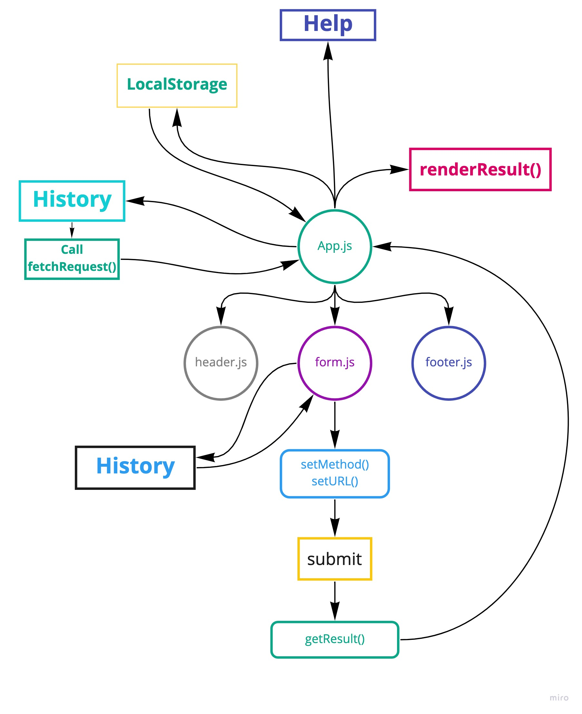

# Project: RESTy

**Author:** _Waleed A. Afifi_

In this final phase of the RESTy build, we will be adding some more fidelity to the application, including a menu with a ore detailed view of our history, as well as an about us page.

**The following user stories detail the major functionality for this phase of the project.**

- As a user, I want to see all of my previous queries as a separate page so that I can browse them in greater detail
- As a user, I would like to view a separate “Help” page so I can learn how the application works

### Deployed version
[Deployed on GitHub](https://waleedafifi-401-advanced-javascript.github.io/resty/)

### Setup
```
git clone https://github.com/waleedafifi-401-advanced-javascript/resty.git
cd resty

npm install
```

### How to initialize/run your application  
```
npm start
```

### How to use it
On the website, enter a api request url, select a method, and press **Go**. The results will be displayed beneath. At the moment, every request will be a GET request. A sample url you can test is this:

```
https://swapi.dev/api/people/
```

#### UML

