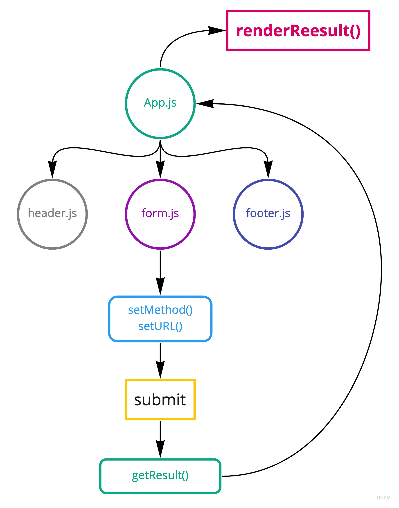

# Project: RESTy

**Author:** _Waleed A. Afifi_

In phase 2, we will be connecting RESTy to live APIs, fetching and displaying remote data. Our primary focus will be to service GET requests

### Setup
```
git clone https://github.com/waleedafifi-401-advanced-javascript/resty.git
cd resty

npm install
```

### How to initialize/run your application  
```
npm start
```

### How to use it
On the website, enter a api request url, select a method, and press **Go**. The results will be displayed beneath. At the moment, every request will be a GET request. A sample url you can test is this:

```
https://swapi.dev/api/people/
```

#### UML

