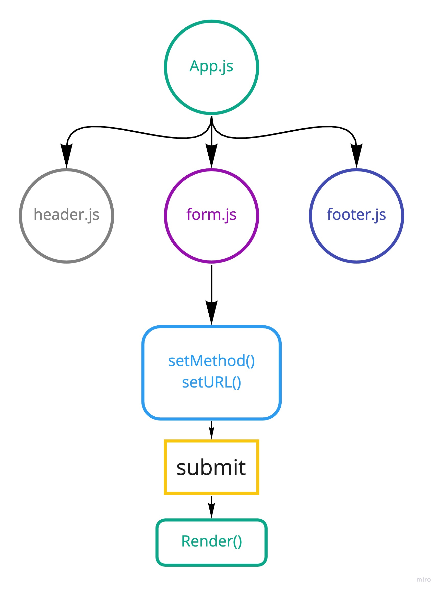

# Project: RESTy

**Author:** _Waleed A. Afifi_

We begin the first of a 4-Phase build of the RESTy application, written in React. In this first phase, our goal is to setup the basic scaffolding of the application, with intent being to add more functionality to the system as we go. This initial build sets up the file structure so that we can progressively build this application in a scalable manner


### Setup
```
git clone https://github.com/waleedafifi-401-advanced-javascript/resty.git
cd resty

npm install
```

### How to initialize/run your application  
```
npm start
```

#### UML

